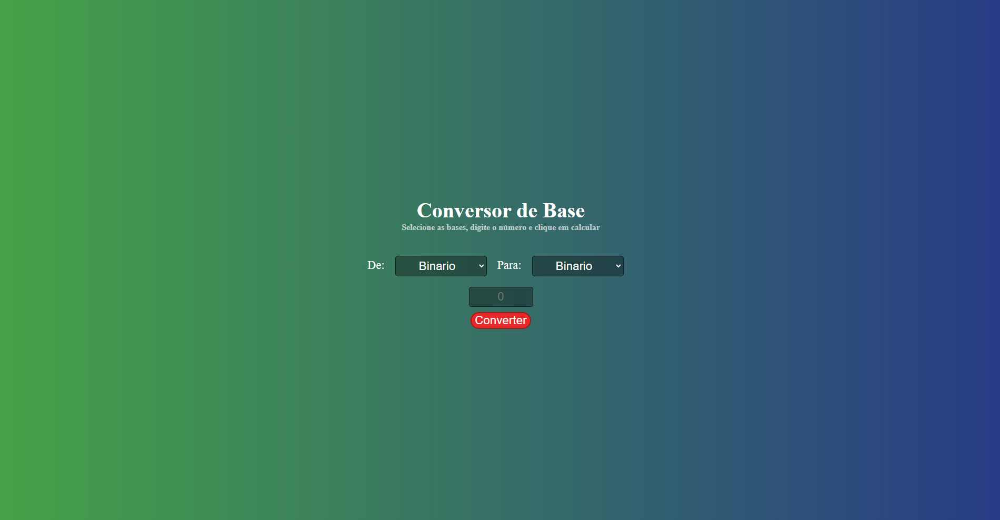
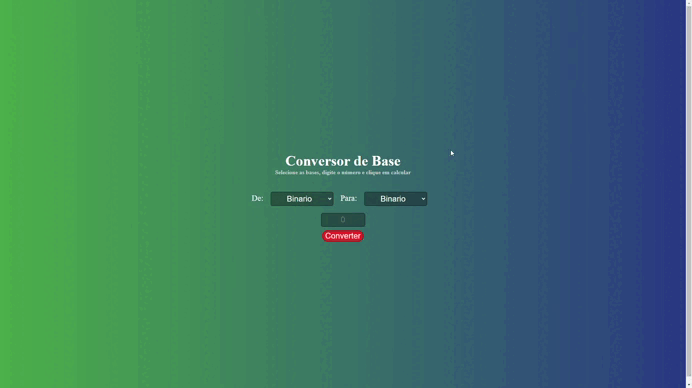

# Conversor de Base 🔢

## O que é esse projeto? 💭
Esse é um projeto feito com HTML, CSS e JS que utiliza de um input com dois selects box para mudar escolher a base númerica e assim fazer a conversão.

## Como rodar esse projeto? 💻
Para rodar o projeto basta dar dois cliques no *index.html* uma vez que a pasta do projeto esteja aberta no sistema de arquivos do seu sistema operacional.

Alternativamente, você também pode usar a extensão *Live Server* do *VSCode* para rodar o projeto.

## Como usar? 🕹️
Quando estiver rodando, basta você digitar um número e escolher a base que deseja converter. As bases existentes são:

- Hexadecimal
- Decimal
- Binário
- Octal

Ao escolher uma dessa, o programa irá realizar a devida conversão.

## Tecnologiar usadas ⚙️
 
 
 

 ## Features 📒
 - Input para por o número
 - Select Box para escolher a base númerica
 - Botão para converter a base

  ## Como este projeto foi implementado? 👨‍💻
 Este projeto foi implementado usando HTML, CSS e Javascript.

 Com o JS foi possível utilizar funções nativas da linguagem que converte as bases automaticamente. Porém, para saber qual base foi escolhida, foi necessário pegar o valor contido das selects box.

## Contriubuidores
 - [Caio](github.com/caiosss) - mantedor do projeto.

## Precisa de ajuda? 🆘 
Você pode entrar em contato comigo em **caiobarros1712@gmail.com**. 

---
 
Feito com ☕ por Caio
